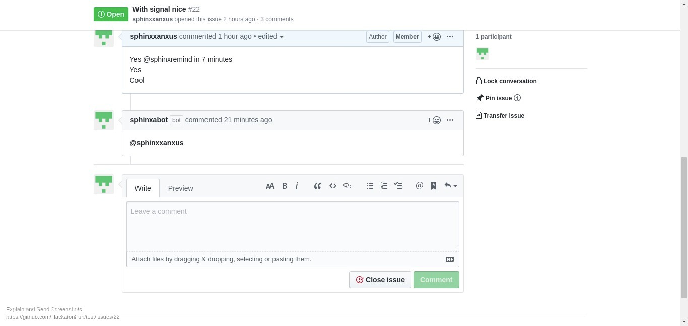

# sphinx-bot
Python Benin Reminder Bot

## Install 

1. Create the virtual environment
```bash
virtualenv --python=python3.7 venv
```

2. Activate virtualenv
```bash
source venv/bin/activate
```

3. Install dependencies
```bash
pip install -r requirements.txt
```
# Usage
This bot remind you when you tell him to remind. To use this app, please install it [here](https://github.com/apps/sphinxabot).
Use this app using this pattern `@sphinxremind`.
For example, if you want to be reminded in 7 days, In your comment on the issue, you will add: 
`@sphinxremind in 7 days`



This bot support: 
1. minutes
2. hours
3. days
5. weeks
6. months
7. years
